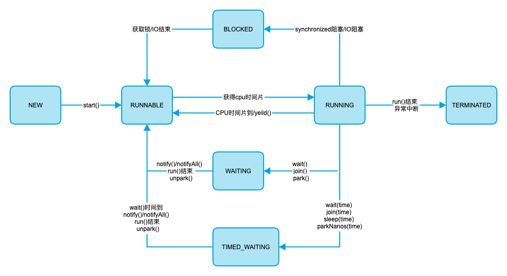

### 线程状态

* NEW 初始化状态，线程被构建，但是还没有被调用start()方法
* RUNNABLE 状态是线程正在正常运行中, 当然可能会有某种耗时计算/IO等待的操作/CPU时间片切换等, 这个状态下发生的等待一般是其他系统资源, 而不是锁, Sleep等
* BLOCKED  这个状态下, 是在多个线程有同步操作的场景, 比如正在等待另一个线程的synchronized 块的执行释放, 或者可重入的 synchronized块里别人调用wait() 方法, 也就是这里是线程在等待进入临界区
* WAITING  这个状态下是指线程拥有了某个锁之后, 调用了他的wait方法, 等待其他线程/锁拥有者调用 notify / notifyAll 一遍该线程可以继续下一步操作, 
  这里要区分 BLOCKED 和 WATING 的区别, 一个是在临界点外面等待进入, 一个是在理解点里面wait等待别人notify, 线程调用了join方法 join了另外的线程的时候, 也会进入WAITING状态, 等待被他join的线程执行结束
* TIMED_WAITING  这个状态就是有限的(时间限制)的WAITING, 一般出现在调用wait(long), join(long)等情况下, 另外一个线程sleep后, 也会进入TIMED_WAITING状态
* TERMINATED 这个状态下表示 该线程的run方法已经执行完毕了, 基本上就等于死亡了(当时如果线程被持久持有, 可能不会被回收)

### 状态流转如下：

* 线程进入 WAITING/TIMED_WAITING 会释放同步锁，进入等待队列；唤醒后需要重新竞争资源,失败进入 BLOCKED 状态
* BLOCKED 状态跟 I/O 的阻塞是不同的，它不是一般意义上的阻塞，而是特指被 synchronized 块阻塞，即是跟线程同步有关的一个状态。IO阻塞线程不会释放同步锁。

### thread interrupt
interrupt()方法的工作仅仅是改变中断状态，并不是直接中断正在运行的线程。中断的真正原理是当线程被Object.wait(),Thread.join()或sleep()方法阻塞时，
调用interrupt()方法后改变中断状态，而wait/join/sleep这些方法内部会不断地检查线程的中断状态值，当发现中断状态值改变时则抛出InterruptedException异常；
对于没有阻塞的线程，调用interrupt()方法是没有任何作用。

#### interrupt()、interrupted()、isInterrupted() 的区别

* interrupted()属于类方法，而interrupt()和isInterrupted()属于对象方法。
* interrupted()：返回当前线程的中断标志位，并设置中断标志位false；
  interrupt()：设置线程对象的中断标志位为true；
  isInterrupted()：返回线程对象的中断标志位
* 当线程满足两个条件，阻塞状态和中断标志为ture，则会抛出InterruptedException异常，并且会自动将中断标志位设置为false;
  阻塞方法，一般有，Thread.sleep(…)，Object.wait(…)，join(…)，中断不会停止线程;非阻塞状态下，只是设置中断标识

### 参考资料
#### wait join demo
* [thread-java-wait-demo](https://github.com/liuyzss/java-demo/tree/master/src/main/java/com/bk/base/thread)
