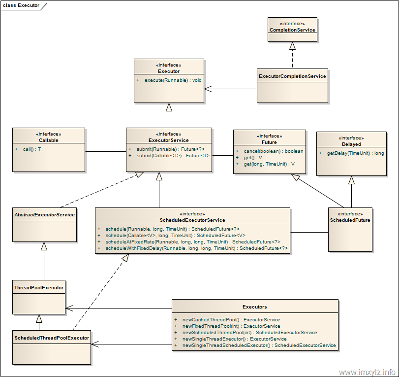

### 类图



### 构造方法参数说明

```java
1.corePoolSize：核心线程数，默认情况下核心线程会一直存活，即使处于闲置状态也不会受存keepAliveTime限制。除非将allowCoreThreadTimeOut设置为true。
2.maximumPoolSize：线程池所能容纳的最大线程数。超过这个数的线程将被阻塞。当任务队列为没有设置大小的LinkedBlockingDeque时，这个值无效。
3.keepAliveTime：非核心线程的闲置超时时间，超过这个时间就会被回收。
4.unit：指定keepAliveTime的单位，如TimeUnit.SECONDS。当将allowCoreThreadTimeOut设置为true时对corePoolSize生效。
5.workQueue：线程池中的任务队列.常用的有三种队列
  a.SynchronousQueue：是一种无缓冲的等待队列，在某次添加元素后必须等待其他线程取走后才能继续添加；
  b.LinkedBlockingDeque：是一个无界缓存的等待队列，不指定容量则为Integer最大值，锁是分离的；
  c.ArrayBlockingQueue：是一个有界缓存的等待队列，必须指定大小，锁是没有分离的；
6.threadFactory：线程工厂，提供创建新线程的功能，通过线程工厂可以对线程的一些属性进行定制。
7.RejectedExecutionHandler：当线程池中的资源已经全部使用，添加新线程被拒绝时，会调用RejectedExecutionHandler的rejectedExecution方法，线程池有以下四种拒绝策略。
  a.AbortPolicy：当任务添加到线程池中被拒绝时，它将抛出RejectedExecutionException 异常。
  b.CallerRunsPolicy：当任务添加到线程池中被拒绝时，会在线程池当前正在运行的Thread线程池中处理被拒绝的任务。
  c.DiscardOldestPolicy：当任务添加到线程池中被拒绝时，线程池会放弃等待队列中最旧的未处理任务，然后将被拒绝的任务添加到等待队列中。
  d.DiscardPolicy：当任务添加到线程池中被拒绝时，线程池将丢弃被拒绝的任务。
```


### 执行过程

- 当一个任务被提交到线程池时，首先查看线程池的核心线程是否都在执行任务，否就选择一条线程执行任务，是就执行第二步。

- 查看核心线程池是否已满，不满就创建一条线程执行任务，否则执行第三步。

- 查看任务队列是否已满，不满就将任务存储在任务队列中，否则执行第四步。

- 查看线程池是否已满，不满就创建一条线程执行任务，否则就按照策略处理无法执行的任务。

  

### 在ThreadPoolExecutor中表现为

- 如果当前运行的线程数小于corePoolSize，那么就创建线程来执行任务（执行时需要获取全局锁）。
- 如果运行的线程大于或等于corePoolSize，那么就把task加入BlockQueue。
- 如果创建的线程数量大于BlockQueue的最大容量，那么创建新线程来执行该任务。
- 如果创建线程导致当前运行的线程数超过maximumPoolSize，就根据饱和策略来拒绝该任务。

### 配置线程个数
- 如果是CPU密集型任务，那么线程池的线程个数应该尽量少一些，一般为CPU的个数+1条线程。
- 如果是IO密集型任务，那么线程池的线程可以放的很大，如2*CPU的个数。
- 对于混合型任务，如果可以拆分的话，通过拆分成CPU密集型和IO密集型两种来提高执行效率；如果不能拆分的的话就可以根据实际情况来调整线程池中线程的个数。

### 监控线程池状态
- taskCount：线程需要执行的任务个数。
- completedTaskCount：线程池在运行过程中已完成的任务数。
- largestPoolSize：线程池曾经创建过的最大线程数量。
- getPoolSize获取当前线程池的线程数量。
- getActiveCount：获取活动的线程的数量
  

### 五种线程池的对比与使用
#### 线程使用的demo

```java
public static void cache() {
        ExecutorService pool = Executors.newCachedThreadPool();
        long start = System.currentTimeMillis();
        pool.execute(() -> {
            int sum = 0;
            for (int i = 0; i < 10; i++) {
                sum = (int) Math.sqrt(i * i - 1 + i);
                System.out.println(sum);
            }
        });
        System.out.println("cache: " + (System.currentTimeMillis() - start));
    }
```

#### newCachedThreadPool

- 重用之前的线程
- 适合执行许多短期异步任务的程序。
- 调用 execute() 将重用以前构造的线程
- 如果没有可用的线程，则创建一个新线程并添加到池中
- 默认为60s未使用就被终止和移除
- 长期闲置的池将会不消耗任何资源

源码：

```java
public static ExecutorService newCachedThreadPool() {
        return new ThreadPoolExecutor(0, Integer.MAX_VALUE,
                                      60L, TimeUnit.SECONDS,
                                      new SynchronousQueue<Runnable>());
    }
```

通过源码可以看出底层调用的是ThreadPoolExecutor方法，传入一个同步的阻塞队列实现缓存。

下面说一下ThreadPoolExecutor

```java
public ThreadPoolExecutor(int corePoolSize,
                              int maximumPoolSize,
                              long keepAliveTime,
                              TimeUnit unit,
                              BlockingQueue<Runnable> workQueue) {
        this(corePoolSize, maximumPoolSize, keepAliveTime, unit, workQueue,
             Executors.defaultThreadFactory(), defaultHandler);
    }
```

通过源码可以看出，我们可以传入线程池的核心线程数(最小线程数)，最大线程数量，保持时间，时间单位，阻塞队列这些参数，最大线程数设置为jvm可用的cpu数量为最佳实践

#### newWorkStealingPool

- 获取当前可用的线程数量进行创建作为并行级别
- 使用ForkJoinPool

源码：

```java
public static ExecutorService newWorkStealingPool() {
        return new ForkJoinPool
            (Runtime.getRuntime().availableProcessors(),
             ForkJoinPool.defaultForkJoinWorkerThreadFactory,
             null, true);
    }
```

通过源码可以看出底层调用的是ForkJoinPool线程池

下面说一下ForkJoinPool

```java
public ForkJoinPool(int parallelism,
                        ForkJoinWorkerThreadFactory factory,
                        UncaughtExceptionHandler handler,
                        boolean asyncMode) {
        this(checkParallelism(parallelism),
             checkFactory(factory),
             handler,
             asyncMode ? FIFO_QUEUE : LIFO_QUEUE,
             "ForkJoinPool-" + nextPoolId() + "-worker-");
        checkPermission();
    }
```

使用一个无限队列来保存需要执行的任务，可以传入线程的数量，不传入，则默认使用当前计算机中可用的cpu数量，使用分治法来解决问题，使用fork()和join()来进行调用

#### newSingleThreadExecutor

- 在任何情况下都不会有超过一个任务处于活动状态
- 与newFixedThreadPool(1)不同是不能重新配置加入线程，使用FinalizableDelegatedExecutorService进行包装
- 能保证执行顺序，先提交的先执行。
- 当线程执行中出现异常，去创建一个新的线程替换之 源码：

```java
public static ExecutorService newSingleThreadExecutor() {
        return new FinalizableDelegatedExecutorService
            (new ThreadPoolExecutor(1, 1,
                                    0L, TimeUnit.MILLISECONDS,
                                    new LinkedBlockingQueue<Runnable>()));
    }
```

#### newFixedThreadPool

- 创建重用固定数量线程的线程池，不能随时新建线程
- 当所有线程都处于活动状态时，如果提交了其他任务， 他们将在队列中等待一个线程可用
- 线程会一直存在，直到调用shutdown

源码：

```java
public static ExecutorService newFixedThreadPool(int nThreads) {
        return new ThreadPoolExecutor(nThreads, nThreads,
                                      0L, TimeUnit.MILLISECONDS,
                                      new LinkedBlockingQueue<Runnable>());
    }
```

#### newScheduledThreadPool

- 设定延迟时间，定期执行
- 空闲线程会进行保留

源码：

```java
return new ScheduledThreadPoolExecutor(corePoolSize);
```

通过源码可以看出底层调用的是一个ScheduledThreadPoolExecutor，然后传入线程数量

下面来介绍一下ScheduledThreadPoolExecutor

```java
public ScheduledThreadPoolExecutor(int corePoolSize) {
        super(corePoolSize, Integer.MAX_VALUE, 0, NANOSECONDS,
              new DelayedWorkQueue());
    }
```

通过源码可以看出底层调用了ThreadPoolExecutor，维护了一个延迟队列，可以传入线程数量，传入延时的时间等参数，下面给出一个demo

```java
public static void main(String[] args) {
        ScheduledExecutorService pool = Executors.newScheduledThreadPool(5);
        for (int i = 0; i < 15; i = i + 5) {
            pool.schedule(() -> System.out.println("我被执行了，当前时间" + new Date()), i, TimeUnit.SECONDS);
        }
        pool.shutdown();
    }
```

执行结果

```java
我被执行了，当前时间Fri Jan 12 11:20:41 CST 2018
我被执行了，当前时间Fri Jan 12 11:20:46 CST 2018
我被执行了，当前时间Fri Jan 12 11:20:51 CST 2018
```

有的小伙伴可能会用疑问，为什么使用schedule()而不使用submit()或者execute()呢，下面通过源码来分析

```java
    public void execute(Runnable command) {
        schedule(command, 0, NANOSECONDS);
    }
    public Future<?> submit(Runnable task) {
        return schedule(task, 0, NANOSECONDS);
    }
```

通过源码可以发现这两个方法都是调用的schedule(),而且将延时时间设置为了0，所以想要实现延时操作，需要直接调用schedule()

下面我们再来分析一下submit()和execute()的以及shutdown()和shutdownNow()的区别

- submit()，提交一个线程任务，可以接受回调函数的返回值吗，适用于需要处理返回着或者异常的业务场景
- execute()，执行一个任务，没有返回值
- shutdown()，表示不再接受新任务，但不会强行终止已经提交或者正在执行中的任务
- shutdownNow()，对于尚未执行的任务全部取消，正在执行的任务全部发出interrupt()，停止执行

#### 五种线程池的适应场景

1. newCachedThreadPool：用来创建一个可以无限扩大的线程池，适用于服务器负载较轻，执行很多短期异步任务。
2. newFixedThreadPool：创建一个固定大小的线程池，因为采用无界的阻塞队列，所以实际线程数量永远不会变化，适用于可以预测线程数量的业务中，或者服务器负载较重，对当前线程数量进行限制。
3. newSingleThreadExecutor：创建一个单线程的线程池，适用于需要保证顺序执行各个任务，并且在任意时间点，不会有多个线程是活动的场景。
4. newScheduledThreadPool：可以延时启动，定时启动的线程池，适用于需要多个后台线程执行周期任务的场景。
5. newWorkStealingPool：创建一个拥有多个任务队列的线程池，可以减少连接数，创建当前可用cpu数量的线程来并行执行，适用于大耗时的操作，可以并行来执行

### 源码解析

https://www.jianshu.com/p/a977ab6704d7

