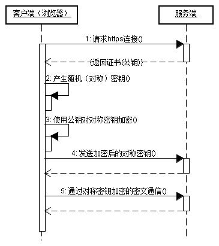

HTTP是一个属于应用层的面向对象的协议，由于其简捷、快速的方式，适用于分布式超媒体信息系统。它于1990年提出，经过几年的使用与发展，得到不断地完善和扩展。目前在WWW中使用的是HTTP/1.0的第六版，HTTP/1.1的规范化工作正在进行之中，而且HTTP-NG(Next
Generation of HTTP)的建议已经提出。

## HTTP

### HTTP协议的主要特点

1. 支持客户/服务器模式。
2. 简单快速：客户向服务器请求服务时，只需传送请求方法和路径。请求方法常用的有GET、HEAD、POST。每种方法规定了客户与服务器联系的类型不同。由于HTTP协议简单，使得HTTP服务器的程序规模小，因而通信速度很快。
3. 灵活：HTTP允许传输任意类型的数据对象。正在传输的类型由Content-Type加以标记。
4. 无连接：无连接的含义是限制每次连接只处理一个请求。服务器处理完客户的请求，并收到客户的应答后，即断开连接。采用这种方式可以节省传输时间。
5. 无状态：HTTP协议是无状态协议。无状态是指协议对于事务处理没有记忆能力。缺少状态意味着如果后续处理需要前面的信息，则它必须重传，这样可能导致每次连接传送的数据量增大。另一方面，在服务器不需要先前信息时它的应答就较快。

### HTTP协议URL详解

http（超文本传输协议）是一个基于请求与响应模式的、无状态的、应用层的协议，常基于TCP的连接方式，HTTP1.1版本中给出一种持续连接的机制，绝大多数的Web开发，都是构建在HTTP协议之上的Web应用。
HTTP URL (URL是一种特殊类型的URI，包含了用于查找某个资源的足够的信息)的格式如下：
http://host[":"port][abs_path] 　　http表示要通过HTTP协议来定位网络资源；host表示合法的Internet主机域名或者IP地址；port指定一个端口号，为空则使用缺省端口80；abs_path指定请求资源的URI；如果URL中没有给出abs_path，那么当它作为请求URI时，必须以“/”的形式给出，通常这个工作浏览器自动帮我们完成。
*eg:*
1. 输入：www.guet.edu.cn  浏览器自动转换成：http://www.guet.edu.cn/
2. http:192.168.0.116:8080/index.jsp 

### HTTP协议请求详解

http请求由三部分组成，分别是：请求行、消息报头、请求正文
`CRLF -- Carriage-Return Line-Feed 回车换行`
1. 请求行以一个方法符号开头，以空格分开，后面跟着请求的URI和协议的版本，格式如下：
Method Request-URI HTTP-Version CRLF  
其中
Method表示请求方法；Request-URI是一个统一资源标识符；HTTP-Version表示请求的HTTP协议版本；CRLF表示回车和换行（除了作为结尾的CRLF外，不允许出现单独的CR或LF字符）。
请求方法（所有方法全为大写）有多种，各个方法的解释如下：
GET　　　　请求获取Request-URI所标识的资源
POST　　　 在Request-URI所标识的资源后附加新的数据
HEAD　　　 请求获取由Request-URI所标识的资源的响应消息报头
PUT　　　　 请求服务器存储一个资源，并用Request-URI作为其标识
DELETE　　 请求服务器删除Request-URI所标识的资源
TRACE　　  请求服务器回送收到的请求信息，主要用于测试或诊断
CONNECT　 保留将来使用
OPTIONS　  请求查询服务器的性能，或者查询与资源相关的选项和需求
应用举例：
GET方法：在浏览器的地址栏中输入网址的方式访问网页时，浏览器采用GET方法向服务器获取资源，eg:GET /form.html HTTP/1.1
(CRLF)
POST方法要求被请求服务器接受附在请求后面的数据，常用于提交表单。
eg：POST /reg.jsp HTTP/ (CRLF)
Accept:image/gif,image/x-xbit,... (CRLF)
...
HOST:www.guet.edu.cn (CRLF)
Content-Length:22 (CRLF)
Connection:Keep-Alive (CRLF)
Cache-Control:no-cache (CRLF)
(CRLF)         //该CRLF表示消息报头已经结束，在此之前为消息报头
user=jeffrey&pwd=1234  //此行以下为提交的数据
HEAD方法与GET方法几乎是一样的，对于HEAD请求的回应部分来说，它的HTTP头部中包含的信息与通过GET请求所得到的信息是相同的。利用这个方法，不必传输整个资源内容，就可以得到Request-URI所标识的资源的信息。该方法常用于测试超链接的有效性，是否可以访问，以及最近是否更新。
2. 请求报头后述
3. 请求正文(略) 

### HTTP协议响应详解

在接收和解释请求消息后，服务器返回一个HTTP响应消息。
HTTP响应也是由三个部分组成，分别是：状态行、消息报头、响应正文
1. 状态行格式如下：
HTTP-Version Status-Code Reason-Phrase CRLF
其中，HTTP-Version表示服务器HTTP协议的版本；Status-Code表示服务器发回的响应状态代码；Reason-Phrase表示状态代码的文本描述。
状态代码有三位数字组成，第一个数字定义了响应的类别，且有五种可能取值：
1xx：指示信息--表示请求已接收，继续处理
2xx：成功--表示请求已被成功接收、理解、接受
3xx：重定向--要完成请求必须进行更进一步的操作
4xx：客户端错误--请求有语法错误或请求无法实现
5xx：服务器端错误--服务器未能实现合法的请求
常见状态代码、状态描述、说明：
200 OK      //客户端请求成功
400 Bad Request  //客户端请求有语法错误，不能被服务器所理解
401 Unauthorized //请求未经授权，这个状态代码必须和WWW-Authenticate报头域一起使用 
403 Forbidden  //服务器收到请求，但是拒绝提供服务
404 Not Found  //请求资源不存在，eg：输入了错误的URL
500 Internal Server Error //服务器发生不可预期的错误
503 Server Unavailable  //服务器当前不能处理客户端的请求，一段时间后可能恢复正常
eg：HTTP/1.1 200 OK （CRLF）
2. 响应报头后述
3. 响应正文就是服务器返回的资源的内容 

### HTTP协议消息报头详解

HTTP消息由客户端到服务器的请求和服务器到客户端的响应组成。请求消息和响应消息都是由开始行（对于请求消息，开始行就是请求行，对于响应消息，开始行就是状态行），消息报头（可选），空行（只有CRLF的行），消息正文（可选）组成。

HTTP消息报头包括普通报头、请求报头、响应报头、实体报头。
每一个报头域都是由名字+“：”+空格+值 组成，消息报头域的名字是大小写无关的。

1. 普通报头 　　在普通报头中，有少数报头域用于所有的请求和响应消息，但并不用于被传输的实体，只用于传输的消息。
eg：
Cache-Control  
用于指定缓存指令，缓存指令是单向的（响应中出现的缓存指令在请求中未必会出现），且是独立的（一个消息的缓存指令不会影响另一个消息处理的缓存机制），HTTP1.0使用的类似的报头域为Pragma。
请求时的缓存指令包括：no-cache（用于指示请求或响应消息不能缓存）、no-store、max-age、max-stale、min-fresh、only-if-cached;
响应时的缓存指令包括：public、private、no-cache、no-store、no-transform、must-revalidate、proxy-revalidate、max-age、s-maxage.
eg：为了指示IE浏览器（客户端）不要缓存页面，服务器端的JSP程序可以编写如下：response.sehHeader("Cache-Control","no-cache");
//response.setHeader("Pragma","no-cache");作用相当于上述代码，通常两者//合用
这句代码将在发送的响应消息中设置普通报头域：Cache-Control:no-cache
Date普通报头域表示消息产生的日期和时间
Connection普通报头域允许发送指定连接的选项。例如指定连接是连续，或者指定“close”选项，通知服务器，在响应完成后，关闭连接

2. 请求报头
　　请求报头允许客户端向服务器端传递请求的附加信息以及客户端自身的信息。
常用的请求报头
Accept请求报头域用于指定客户端接受哪些类型的信息。eg：Accept：image/gif，表明客户端希望接受GIF图象格式的资源；Accept：text/html，表明客户端希望接受html文本。
Accept-Charset请求报头域用于指定客户端接受的字符集。eg：Accept-Charset:iso-8859-1,gb2312.如果在请求消息中没有设置这个域，缺省是任何字符集都可以接受。、
Accept-Encoding请求报头域类似于Accept，但是它是用于指定可接受的内容编码。eg：Accept-Encoding:gzip.deflate.如果请求消息中没有设置这个域服务器假定客户端对各种内容编码都可以接受。
Accept-Language请求报头域类似于Accept，但是它是用于指定一种自然语言。eg：Accept-Language:zh-cn.如果请求消息中没有设置这个报头域，服务器假定客户端对各种语言都可以接受。
Authorization请求报头域主要用于证明客户端有权查看某个资源。当浏览器访问一个页面时，如果收到服务器的响应代码为401（未授权），可以发送一个包含Authorization请求报头域的请求，要求服务器对其进行验证。
Host请求报头域主要用于指定被请求资源的Internet主机和端口号，它通常从HTTP
URL中提取出来的，发送请求时，该报头域是必需的，eg：我们在浏览器中输入：http://www.guet.edu.cn/index.html
浏览器发送的请求消息中，就会包含Host请求报头域，如下：Host：www.guet.edu.cn
此处使用缺省端口号80，若指定了端口号，则变成：Host：www.guet.edu.cn:指定端口号
User-Agent我们上网登陆论坛的时候，往往会看到一些欢迎信息，其中列出了你的操作系统的名称和版本，你所使用的浏览器的名称和版本，这往往让很多人感到很神奇，实际上，服务器应用程序就是从User-Agent这个请求报头域中获取到这些信息。User-Agent请求报头域允许客户端将它的操作系统、浏览器和其它属性告诉服务器。不过，这个报头域不是必需的，如果我们自己编写一个浏览器，不使用User-Agent请求报头域，那么服务器端就无法得知我们的信息了。
请求报头举例：
GET /form.html HTTP/1.1 (CRLF)
Accept:image/gif,image/x-xbitmap,image/jpeg,application/x-shockwave-flash,application/vnd.ms-excel,application/vnd.ms-powerpoint,application/msword,*/*
(CRLF)
Accept-Language:zh-cn (CRLF)
Accept-Encoding:gzip,deflate (CRLF)
If-Modified-Since:Wed,05 Jan 2007 11:21:25 GMT (CRLF)
If-None-Match:W/"80b1a4c018f3c41:8317" (CRLF)
User-Agent:Mozilla/4.0(compatible;MSIE6.0;Windows NT 5.0) (CRLF)
Host:www.guet.edu.cn (CRLF)
Connection:Keep-Alive (CRLF)
(CRLF)
3. 响应报头
　　响应报头允许服务器传递不能放在状态行中的附加响应信息，以及关于服务器的信息和对Request-URI所标识的资源进行下一步访问的信息。
常用的响应报头
Location响应报头域用于重定向接受者到一个新的位置。Location响应报头域常用在更换域名的时候。
Server响应报头域包含了服务器用来处理请求的软件信息。与User-Agent请求报头域是相对应的。下面是Server响应报头域的一个例子：Server：Apache-Coyote/1.1
WWW-Authenticate响应报头域必须被包含在401（未授权的）响应消息中，客户端收到401响应消息时候，并发送Authorization报头域请求服务器对其进行验证时，服务端响应报头就包含该报头域。
eg：WWW-Authenticate:Basic realm="Basic Auth Test!"  //可以看出服务器对请求资源采用的是基本验证机制。

4. 实体报头
　　请求和响应消息都可以传送一个实体。一个实体由实体报头域和实体正文组成，但并不是说实体报头域和实体正文要在一起发送，可以只发送实体报头域。实体报头定义了关于实体正文（eg：有无实体正文）和请求所标识的资源的元信息。
常用的实体报头
Content-Encoding实体报头域被用作媒体类型的修饰符，它的值指示了已经被应用到实体正文的附加内容的编码，因而要获得Content-Type报头域中所引用的媒体类型，必须采用相应的解码机制。Content-Encoding这样用于记录文档的压缩方法，eg：Content-Encoding：gzip
Content-Language实体报头域描述了资源所用的自然语言。没有设置该域则认为实体内容将提供给所有的语言阅读
者。eg：Content-Language:da
Content-Length实体报头域用于指明实体正文的长度，以字节方式存储的十进制数字来表示。
Content-Type实体报头域用语指明发送给接收者的实体正文的媒体类型。eg：
Content-Type:text/html;charset=ISO-8859-1
Content-Type:text/html;charset=GB2312
Last-Modified实体报头域用于指示资源的最后修改日期和时间。
Expires实体报头域给出响应过期的日期和时间。为了让代理服务器或浏览器在一段时间以后更新缓存中(再次访问曾访问过的页面时，直接从缓存中加载，缩短响应时间和降低服务器负载)的页面，我们可以使用Expires实体报头域指定页面过期的时间。eg：Expires：Thu，15
Sep 2006 16:23:12 GMT
HTTP1.1的客户端和缓存必须将其他非法的日期格式（包括0）看作已经过期。eg：为了让浏览器不要缓存页面，我们也可以利用Expires实体报头域，设置为0，jsp中程序如下：response.setDateHeader("Expires","0");

```java
public class HttpUtil {
    
    public static String httpGet(String httpUrl) {
        String result = "";
        DefaultHttpClient httpclient = new DefaultHttpClient();// 创建http客户端
        HttpGet httpget = new HttpGet(httpUrl);
        HttpResponse response = null;
        HttpParams params = httpclient.getParams(); // 计算网络超时用
        HttpConnectionParams.setConnectionTimeout(params, 15 * 1000);
        HttpConnectionParams.setSoTimeout(params, 20 * 1000);
        
        try {
            response = httpclient.execute(httpget);
            HttpEntity entity = response.getEntity();// 得到http的内容
            response.getStatusLine().getStatusCode();// 得到http的状态返回值
            result = EntityUtils.toString(response.getEntity());// 得到具体的返回值，一般是xml文件
            entity.consumeContent();// 如果entity不为空，则释放内存空间
            httpclient.getCookieStore();// 得到cookis
            httpclient.getConnectionManager().shutdown();// 关闭http客户端
        } catch (ClientProtocolException e) {
            e.printStackTrace();
        } catch (IOException e) {
            e.printStackTrace();
        }
        return result;
    }

    public static String httpPost(String httpUrl, String data) {
        String result = "";
        DefaultHttpClient httpclient = new DefaultHttpClient();
        HttpPost httpPost = new HttpPost(httpUrl);
        // httpclient.setCookieStore(DataDefine.mCookieStore);
        
        HttpParams params = httpclient.getParams(); // 计算网络超时用
        HttpConnectionParams.setConnectionTimeout(params, 15 * 1000);
        HttpConnectionParams.setSoTimeout(params, 20 * 1000);
        httpPost.setHeader("Content-Type", "text/xml");
        StringEntity httpPostEntity;
        
        try {
            httpPostEntity = new StringEntity(data, "UTF-8");
            httpPost.setEntity(httpPostEntity);
            HttpResponse response = httpclient.execute(httpPost);
            HttpEntity entity = response.getEntity();// 得到http的内容
            response.getStatusLine().getStatusCode();// 得到http的状态返回值
            result = EntityUtils.toString(response.getEntity());// 得到具体的返回值，一般是xml文件
            entity.consumeContent();// 如果entity不为空，则释放内存空间
            httpclient.getCookieStore();// 得到cookis
            httpclient.getConnectionManager().shutdown();// 关闭http客户端
        } catch (Exception e) {
            e.printStackTrace();
        }// base64是经过编码的字符串，可以理解为字符串
            // StringEntity httpPostEntity = new StringEntity("UTF-8");
        return result;
    }
}
```
## HTTPS
HTTPS（Hypertext Transfer Protocol over Secure Socket
Layer，基于SSL的HTTP协议）使用了HTTP协议，但HTTPS使用不同于HTTP协议的默认端口及一个加密、身份验证层（HTTP与TCP之间）。这个协议的最初研发由网景公司进行，提供了身份验证与加密通信方法，现在它被广泛用于互联网上安全敏感的通信。

*客户端在使用HTTPS方式与Web服务器通信时有以下几个步骤，如图所示。*
1. 客户使用https的URL访问Web服务器，要求与Web服务器建立SSL连接。
2. Web服务器收到客户端请求后，会将网站的证书信息（证书中包含公钥）传送一份给客户端。
3. 客户端的浏览器与Web服务器开始协商SSL连接的安全等级，也就是信息加密的等级。
4. 客户端的浏览器根据双方同意的安全等级，建立会话密钥，然后利用网站的公钥将会话密钥加密，并传送给网站。
5. Web服务器利用自己的私钥解密出会话密钥。
6. Web服务器利用会话密钥加密与客户端之间的通信。



```java
public class HttpsUtil {
    static TrustManager[] xtmArray = new MytmArray[] { new MytmArray() };// 创建信任规则列表
    private final static int CONNENT_TIMEOUT = 15000;
    private final static int READ_TIMEOUT = 15000;
    static HostnameVerifier DO_NOT_VERIFY = new HostnameVerifier() {
        public boolean verify(String hostname, SSLSession session) {
            return true;
        }
    };

    /**
     * 信任所有主机-对于任何证书都不做检查 Create a trust manager that does not validate
     * certificate chains， Android 采用X509的证书信息机制，Install the all-trusting trust
     * manager
     */
    private static void trustAllHosts() {
        try {
            SSLContext sc = SSLContext.getInstance("TLS");
            sc.init(null, xtmArray, new java.security.SecureRandom());
            HttpsURLConnection
                    .setDefaultSSLSocketFactory(sc.getSocketFactory());
            // 不进行主机名确认,对所有主机
            HttpsURLConnection.setDefaultHostnameVerifier(DO_NOT_VERIFY);
        } catch (Exception e) {
            e.printStackTrace();
        }
    }

    // /**
    // * https get方法，返回值是https请求，服务端返回的数据string类型，数据进行xml解析
    // * */
    // public static String HttpsGet(String httpsurl) {
    // return HttpsPost(httpsurl, null);
    //
    // }
    /**
     * https post方法，返回值是https请求，服务端返回的数据string类型，数据进行xml解析
     * */
    public static String HttpsPost(String httpsurl, String data) {
        String result = null;
        HttpURLConnection http = null;
        URL url;
        try {
            url = new URL(httpsurl);
            // 判断是http请求还是https请求
            if (url.getProtocol().toLowerCase().equals("https")) {
                trustAllHosts();
                http = (HttpsURLConnection) url.openConnection();
                ((HttpsURLConnection) http).setHostnameVerifier(DO_NOT_VERIFY);// 不进行主机名确认
            } else {
                http = (HttpURLConnection) url.openConnection();
            }

            http.setConnectTimeout(CONNENT_TIMEOUT);// 设置超时时间
            http.setReadTimeout(READ_TIMEOUT);
            if (data == null) {
                http.setRequestMethod("GET");// 设置请求类型
                http.setDoInput(true);
                // http.setRequestProperty("Content-Type", "text/xml");
                if (AppSession.mCookieStore != null)
                    http.setRequestProperty("Cookie", AppSession.mCookieStore);
            } else {
                http.setRequestMethod("POST");// 设置请求类型为post
                http.setDoInput(true);
                http.setDoOutput(true);
                // http.setRequestProperty("Content-Type", "text/xml");
                if (AppSession.mCookieStore != null
                        && AppSession.mCookieStore.trim().length() > 0)
                    http.setRequestProperty("Cookie", AppSession.mCookieStore);

                DataOutputStream out = new DataOutputStream(
                        http.getOutputStream());
                out.writeBytes(data);
                out.flush();
                out.close();
            }

            // 设置http返回状态200（ok）还是403
            AppSession.httpsResponseCode = http.getResponseCode();
            BufferedReader in = null;
            if (AppSession.httpsResponseCode == 200) {
                getCookie(http);
                in = new BufferedReader(new InputStreamReader(
                        http.getInputStream()));
            } else
                in = new BufferedReader(new InputStreamReader(
                        http.getErrorStream()));
            String temp = in.readLine();
            while (temp != null) {
                if (result != null)
                    result += temp;
                else
                    result = temp;
                temp = in.readLine();
            }
            in.close();
            http.disconnect();
        } catch (Exception e) {
            e.printStackTrace();
        }
        return result;
    }

    /**
     * 得到cookie
     * 
     */
    private static void getCookie(HttpURLConnection http) {
        String cookieVal = null;
        String key = null;
        AppSession.mCookieStore = "";
        for (int i = 1; (key = http.getHeaderFieldKey(i)) != null; i++) {
            if (key.equalsIgnoreCase("set-cookie")) {
                cookieVal = http.getHeaderField(i);
                cookieVal = cookieVal.substring(0, cookieVal.indexOf(";"));
                AppSession.mCookieStore = AppSession.mCookieStore + cookieVal
                        + ";";
            }
        }
    }
}
```

## WebService
学习.《Web Service开发详解》资料中详细介绍了WebService
